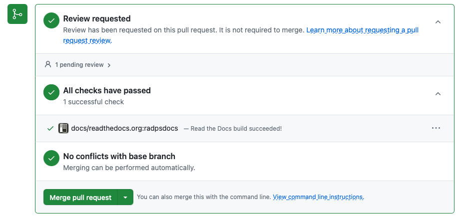

# How to build and update these docs


## Read-the-docs and github

Opening a new pull request (PRs) will trigger the docs to build on read-the-docs. The success of the build will be reported back in the PR with a link to the rtd build log.


## Local


Local builds require python >= 3.11 with the following packages installed (see the `requirements.txt` file in the repository):
- sphinx>=6.0
- myst-parser
- sphinx-rtd-theme


To build a local version of these docs:
1. Clone the repository (https://github.com/casangi/radpsdocs). Switch to the `radpsdocs` directory.

    ```
    # If needed, alter github link for your fork
    git clone https://github.com/casangi/radpsdocs.git
    cd radpsdocs
    ```

2. Install required dependencies with pip:

    ```
    pip install -r requirements.txt
    ```

3. Run `make` to build. The local build and HTML files will be placed in `docs/_build/`.

    ```
    make
    cd docs/_build/html/
    # Open index.html from the browser.
    ```


## Contributing to the documentation

Contributions should follow the the [git feature branch workflow](https://www.atlassian.com/git/tutorials/comparing-workflows/feature-branch-workflow).

This includes:

1. Create a fork of the branch (if one does not exist) from the `radpsdocs` page (https://github.com/casangi/radpsdocs).

2. Locally, clone the forked repository from the fork's github page. The link to clone can be copied from the green "<> Code" button. 

    ```
    git clone #Your fork
    cd radpsdocs
    ```

3. Add the parent repository to the remote repositories (see [this guide](https://docs.github.com/en/pull-requests/collaborating-with-pull-requests/working-with-forks/configuring-a-remote-repository-for-a-fork)):

    ```
    git remote add upstream https://github.com/casangi/radpsdocs.git
    git remote -v # You should see 2 entries for "origin" and 2 for "upstream" in the terminal output
    ```

3. Create a new feature branch. Update and commit to the feature branch.

    ```
    git branch <your_branch_name>
    git add <new or changed file(s)>
    git commit -m "Your commit description"
    ...
    ```

4. Push the feature branch to your fork. Then, from github, open a pull request (PR) to trigger the RTD build.

    ```
    git push origin <your_branch_name>
    ```

5. Further commits should be pushed to the same feature branch. These will propagate to the PR.

6. Ensure the RTD build passes in the PR. Each commit will trigger a test build on RTD to preview changes: 

    

    Request a review of the changes prior to merging.

7. After merging, update your local clone and your fork, and delete the feature branch:

    ```
    git checkout main
    git pull upstream main
    git branch -d <new or changed file(s)>
    git push origin main
    ```
