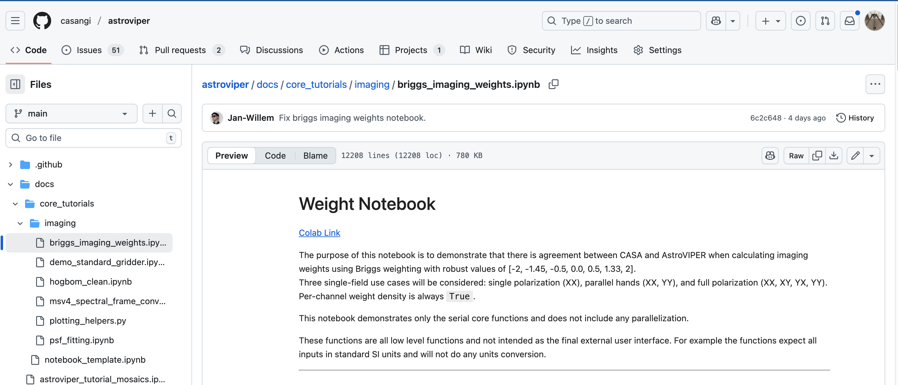
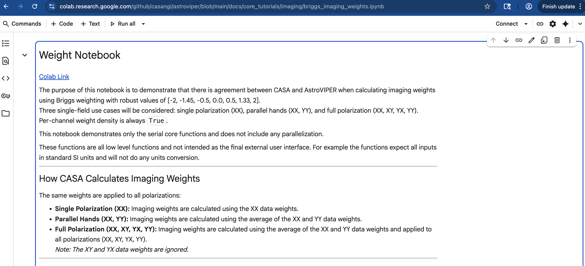

# How to review RADPS Notebooks

All feature development for RADPS will be accompanied by an example notebook to demonstrate the functionality. Below we describe several mechanisms for interacting with the resulting notebooks ranging from very simple to more complex.

## Colab method

This method requires the least amount of effort, but is also the least flexible. To review notebooks via colab, do the following

1. Go to the docs directory in the relevant repository. For the PI2, the most relevant directory is the [astroviper core tutorials directory](https://github.com/casangi/astroviper/tree/main/docs/core_tutorials). 
2. Click on the notebook you are interested in.

3. Click on the colab link in the introduction to the notebook.


## RADPS Hub Method

This method is more complex, but allows the user to interact with the RADPS-Hub infrastructure. It requires the user to be on a VPN or NRAO network.

1. Request connection information from @jsteeb.
2. Navigate to the sprint notebooks in shared. [RADPS Hub interface](../radps_hub_interface.png)
3. Copy the sprint notebook you are interested in from the shared folder into your top directory. *Please do not run the notebook in the shared folder to avoid running into resource issues.*

## Locally using a Virtual Environment

If on Mac OS, you will need to install python-casacore to get the functions to convert msv2 -> msv4 (see the [xradio documentation](https://github.com/casangi/xradio) for more details).

### Install from Wheel
```
conda create --name astroviper python=3.13 --no-default-packages
conda activate astroviper
conda install -c conda-forge python-casacore # on Mac OS
pip install astroviper
```

### Build from source and make it editable (how we develop)
```
conda create --name astroviper python=3.13 --no-default-packages
conda activate astroviper
conda install -c conda-forge python-casacore # on Mac OS
git clone https://github.com/casangi/astroviper.git
cd astroviper
pip install -e .
```